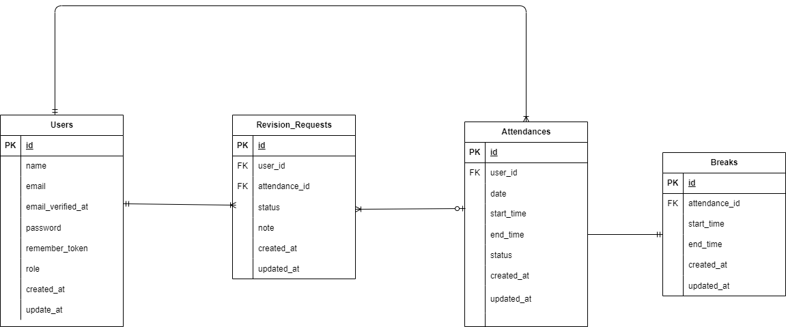

# attendance(勤怠管理アプリ)

## 概要

本プロジェクトは、ユーザーの勤怠と管理を目的とするアプリです。  
勤怠機能、勤怠管理機能、承認機能などを備えています。

# 環境構築

1. Docker を起動する

2. プロジェクト直下で、以下のコマンドを実行する

```
make init
```

※Makefile は実行するコマンドを省略することができる便利な設定ファイルです。コマンドの入力を効率的に行えるようになります。<br>

## メール認証

mailtrap というツールを使用しています。<br>
以下のリンクから会員登録をしてください。　<br>
https://mailtrap.io/

メールボックスの Integrations から 「laravel 7.x and 8.x」を選択し、　<br>
.env ファイルの MAIL_MAILER から MAIL_ENCRYPTION までの項目をコピー＆ペーストしてください。　<br>
MAIL_FROM_ADDRESS は任意のメールアドレスを入力してください。

## ER 図



## テストアカウント

### 管理者ユーザ

- name: 管理者ユーザ
- email: admin@example.com
- password: password

### 一般ユーザ 1

- name: 西 怜奈
- email: reina@coachtech.com
- password: password

### 一般ユーザ 2

- name: 山田 太郎
- email: taro@coachtech.com
- password: password

### 一般ユーザ 3

- name: 増田 一世
- email: issei@coachtech.com
- password: password

### 一般ユーザ 4

- name: 山本　敬吾
- email: keikichi@coachtech.com
- password: password

### 一般ユーザ 5

- name: 秋田 朋美
- email: tomomi@coachtech.com
- password: password

### 一般ユーザ 6

- name: 中西 春夫
- email: norio@coachtech.com
- password: password

## PHPUnit を利用したテストに関して

以下のコマンド:

```
docker-compose exec php bash
php artisan migrate:fresh --env=testing
./vendor/bin/phpunit
```
