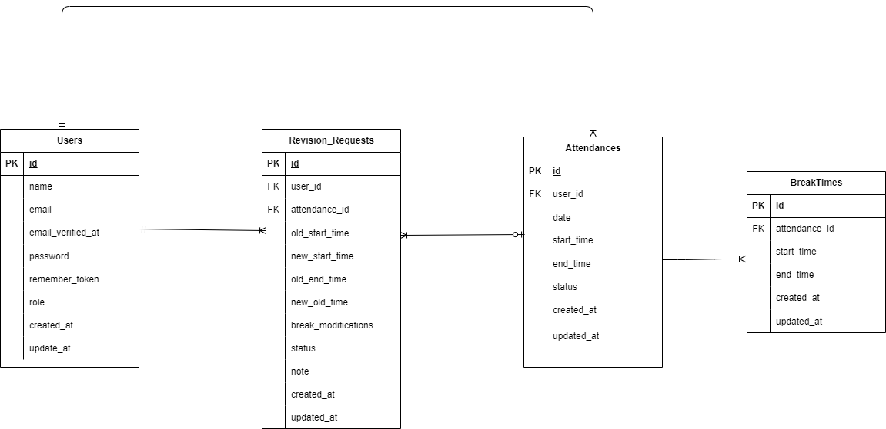

# attendance(勤怠管理アプリ)

## 概要

本プロジェクトは、ユーザーの勤怠と管理を目的とするアプリです。  
勤怠機能、勤怠管理機能、承認機能などを備えています。

## 環境構築
**Dockerビルド**
1. `git clone git@github.com:tominaga-rikiya/attendance.git`
2. DockerDesktopアプリを立ち上げる
3. `docker-compose up -d --build`

> *MacのM1・M2チップのPCの場合、`no matching manifest for linux/arm64/v8 in the manifest list entries`のメッセージが表示されビルドができないことがあります。
エラーが発生する場合は、docker-compose.ymlファイルの「mysql」内に「platform」の項目を追加で記載してください*
``` bash
mysql:
    platform: linux/x86_64(この文追加)
    image: mysql:8.0.26
    environment:
```

**Laravel環境構築**
1. `docker-compose exec php bash`
2. `composer install`
3. 「.env.example」ファイルを 「.env」ファイルに命名を変更。または、新しく.envファイルを作成
4. .envに以下の環境変数を追加(mysqlにてエラーでた場合、「env.example」にも以下の環境変数を追加）
``` text
DB_CONNECTION=mysql
DB_HOST=mysql
DB_PORT=3306
DB_DATABASE=laravel_db
DB_USERNAME=laravel_user
DB_PASSWORD=laravel_pass
```
5. アプリケーションキーの作成
``` bash
php artisan key:generate
```

6. マイグレーションの実行
``` bash
php artisan migrate
```

7. シーディングの実行
``` bash
php artisan db:seed
```
*http://localhostで権限によるエラーが発生する場合はstorage/logs/laravel.logの権限を変更*
``` bash
chmod -R 777 storage
chown -R www-data:www-data storage  # WSL なら「www-data」ではなく「$USER」でもOK
```

*5.6と続けた場合エラーが出たら、もう一度サービスを再起動*
``` bash
docker-compose down
docker-compose up -d
```

## メール認証

mailtrap というツールを使用しています。<br>
以下のリンクから会員登録をしてください。　<br>
https://mailtrap.io/

メールボックスの Integrations から 「laravel 7.x and 8.x」を選択し、　<br>
.env ファイルの MAIL_MAILER から MAIL_ENCRYPTION までの項目をコピー＆ペーストしてください。　<br>
MAIL_FROM_ADDRESS は任意のメールアドレスを入力してください。

## PHPUnit を利用したテストに関して

以下のコマンド:
1.  テスト用データベースを作成
``` bash
docker-compose exec mysql bash
mysql -u root -p
CREATE DATABASE test_database;
EXIT;
```
```
docker-compose exec php bash
php artisan migrate:fresh --env=testing
./vendor/bin/phpunit
```

## ER 図



## テストアカウント

### 管理者ユーザ

- name: 管理者ユーザ
- email: admin@example.com
- password: password

### 一般ユーザ 1

- name: 西 怜奈
- email: reina@coachtech.com
- password: password

### 一般ユーザ 2

- name: 山田 太郎
- email: taro@coachtech.com
- password: password

### 一般ユーザ 3

- name: 増田 一世
- email: issei@coachtech.com
- password: password

### 一般ユーザ 4

- name: 山本　敬吾
- email: keikichi@coachtech.com
- password: password

### 一般ユーザ 5

- name: 秋田 朋美
- email: tomomi@coachtech.com
- password: password

### 一般ユーザ 6

- name: 中西 春夫
- email: norio@coachtech.com
- password: password


## 使用技術(実行環境)
- PHP8.3.0
- Laravel8.83.27
- MySQL8.0.26

## URL
- 開発環境：http://localhost/
- phpMyAdmin:：http://localhost:8080/
